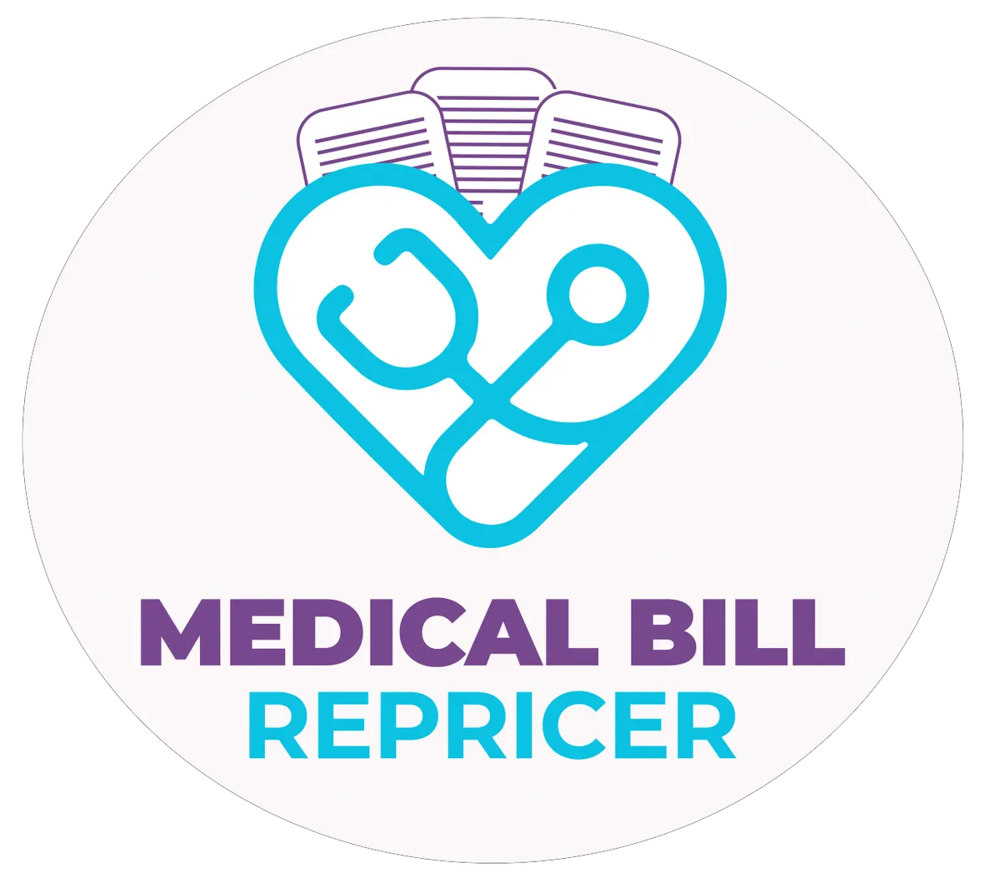

<SlideAudio deckKey="FEN_BasicCore" />

# Basic Core Insurance Benefits Review

Understanding the details and benefits of the **Basic Core Insurance Benefits**

---
transition: fade-out
layout: default
---

## Basic Core Overview

<v-clicks>

- Offered through **American Public Life Insurance Company**
- **Immediate Coverage** for all needs
- **No Waiting Periods** or exclusions
- **Hospital Admissions** and virtual healthcare
- **Managed Care** solutions

</v-clicks>

---
transition: fade-out
layout: one-half-img
image: img/pages/01_basic_core_insurance_benefits_overview.png
---

## Key Features and Benefits

<v-clicks>

**Hospital and Medical Services**

**Pharmacy and Telemedicine Benefits**

**Concierge and Advocacy Services**

**Entertainment and Lifestyle Discounts**

</v-clicks>

<v-click>

**Additional Benefit** through BWA

  

</v-click>

---
transition: fade-out
layout: one-half-img
image: img/pages/04_bwa_member_benefit_package_overview.png
---

## Cost Management Tools

<v-click>

**Medical Bill Repricer** (MBR)
</v-click>

<v-click>

**Reference Based Pricing** System
</v-click>

<v-click>

**Provider Selection** and setup
</v-click>

---
transition: fade-out
layout: one-half-img
image: img/pages/02_medical_bill_repricer_benefits_and_services.png
---

## How Medical Bill Repricer Works

<v-clicks>

1. Enroll through **American Public Life**
   

     
   

2. Select Providers
3. Set Up Appointments
4. Receive Explanation Of Benefits **(EOB)**
5. Negotiate Or Eliminate Balances
6. **Cost-Effective Care**

</v-clicks>

---
transition: fade-out
layout: one-half-img
image: img/pages/02_medical_bill_repricer_benefits_and_services.png
---

## Preventive Care and Wellness

<v-clicks>

- **Virtual Healthcare** Services
- **Wellness Programs** Available
- **Services Provided by AFSLIC**
  

    
  

</v-clicks>

---
transition: fade-out
layout: default
image: img/pages/03_pharmacy_and_telemedicine_benefits.png
---

## Telehealth Services

<v-clicks>

- **Unlimited Doctor Visits**
- **No-cost Consultations**
- **24/7 Availability**
- **Convenient Access to Care**

</v-clicks>

---
transition: fade-out
layout: one-half-img
image: img/pages/03_pharmacy_and_telemedicine_benefits.png
---

## Advocacy and Support Services

<v-clicks>

- **Personalized Healthcare Advocacy**
- **Benefit Understanding** Assistance
- **Claims Filing** Options
- **Financial Negotiations** Support

</v-clicks>

---
transition: fade-out
layout: one-half-img
image: img/pages/04_bwa_member_benefit_package_overview.png
---

## Basic Core Plan (1/2)

<v-click>

**Hospital Admission**
- $500 Per Day First Day
- $100 Per Day Max Ten Days
<Arrow v-bind="{ x1:480, y1:160, x2:560, y2:160, color: 'var(--slidev-theme-accent)' }" />
</v-click>

<v-click>

**Emergency Services**
- $50 Per Day ER
- Urgent Care, Physician Visits
<Arrow v-bind="{ x1:480, y1:215, x2:560, y2:215, color: 'var(--slidev-theme-accent)' }" />
</v-click>

<v-click>

**Medical Bill Repricer**
- 150% To 200% Medicare
- Provider Selection, Setup
- Balance Negotiation

    

<Arrow v-bind="{ x1:480, y1:340, x2:560, y2:340, color: 'var(--slidev-theme-accent)' }" />
</v-click>

---
transition: fade-out
layout: one-half-img
image: img/pages/02_medical_bill_repricer_benefits_and_services.png
---

## Basic Core Plan (2/2)

<v-click>

**Pharmacy Plan**
- Free Acute, Chronic Meds
- Diabetic Supplies, Coaching
<Arrow v-bind="{ x1:480, y1:370, x2:560, y2:370, color: 'var(--slidev-theme-accent)' }" />
</v-click>

<v-click>

**Telemedicine Services**
- Unlimited Virtual Visits
- Free Prescription Club ID
<Arrow v-bind="{ x1:480, y1:410, x2:560, y2:410, color: 'var(--slidev-theme-accent)' }" />
</v-click>

---
transition: fade-out
layout: one-half-img
image: img/pages/03_pharmacy_and_telemedicine_benefits.png
---

## Comparing the Plans

| **Feature** | **Basic Core** | **Basic Core-Plus** | **Premium Plan** |
|---------|----------|----------|-----------|
<v-click>| Hospital Admission | $500 Day 1 | $700 Day 1 | $900 Day 1 |
</v-click><v-click>| Emergency Services | $50 Per Day | $75 Per Day | $100 Per Day |
</v-click><v-click>| Pharmacy Plan | Free Acute Meds | Free All Meds | Free All, Premium Meds |
</v-click><v-click>| Telemedicine | Unlimited Visits | Unlimited Visits | Unlimited, Priority |
</v-click><v-click>| Concierge Services | Included | Enhanced | Premium Level |
</v-click>
---
transition: fade-out
layout: one-half-img
image: img/pages/01_basic_core_insurance_benefits_overview.png
---

## Definitions and Limitations

<v-click>

**Hospital Services**
- Limited to 10 Days
- Requires Pre-Authorization
- Excludes Certain Conditions
<Arrow v-bind="{ x1:480, y1:160, x2:550, y2:160, color: 'var(--slidev-theme-accent)' }" />
</v-click>

<v-click>

**Pharmacy Benefits**
- Generic Only
- No Specialty Drugs
<Arrow v-bind="{ x1:480, y1:255, x2:550, y2:255, color: 'var(--slidev-theme-accent)' }" />
</v-click>

<v-click>

**Telemedicine Access**
- Limited Providers
- No Specialist Access
<Arrow v-bind="{ x1:480, y1:360, x2:550, y2:360, color: 'var(--slidev-theme-accent)' }" />
</v-click>

<v-click>

**Concierge Services**
- Limited to Network
- Requires Appointment
- Excludes Negotiation
<Arrow v-bind="{ x1:480, y1:420, x2:550, y2:420, color: 'var(--slidev-theme-accent)' }" />
</v-click>

---
transition: fade-out
layout: one-half-img
image: img/pages/01_basic_core_insurance_benefits_overview.png
---

## Key Takeaways and Reminders

<v-clicks>

- **Immediate Coverage** benefits
- **No Waiting Periods** included
- **Comprehensive Coverage** benefits
- **Enrollment** required

</v-clicks>

---
transition: fade-out
layout: end
line: Thank you for participating in the Basic Core Insurance Benefits Review. Continue to be great!
---

# Thank You!

Continue to be great!

