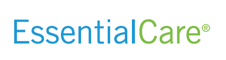

<SlideAudio deckKey="FEN_BasicCore" />

# Basic Core Review

Understanding the details and benefits of the **Basic Core Insurance Plan**

---
transition: fade-out
layout: default
---

## Basic Core Overview

<v-clicks>

- Introduction through **Indemnity Insurance**
- **No Waiting** or Exclusion Period
- **No Coverage** for Pregnancy
- Managed Care Options
- Compare Basic Core and Plus

</v-clicks>

---
transition: fade-out
layout: one-half-img
image: img/pages/01_basic_core_insurance_overview.png
---

## Key Features and Benefits

<v-clicks>

**Hospital Services**

**Outpatient Services**

**Free Prescription Club**

**Discount Rx Cards**

</v-clicks>

<v-click>

**Basic Core-Plus** includes:
- Free Generic Medications
- Unlimited Telemedicine

  

</v-click>

---
transition: fade-out
layout: one-half-img
image: img/pages/01_basic_core_insurance_overview.png
---

## Cost Management Tools

<v-click>

**Medical Bill Repricer** (MBR)

  

</v-click>

<v-click>

**Prepay Options** System
</v-click>

<v-click>

**Advocacy Service** Support

  

</v-click>

---
transition: fade-out
layout: one-half-img
image: img/pages/02_medical_bill_repricer_a_managed_care_solution.png
---

## How Medical Bill Repricer Works

<v-clicks>

1. Enroll through **FirstEnroll**

  

<v-click>

2. Access Reference-Based Pricing
3. Prepay Options Available
4. Receive Explanation of Benefits **(EOB)**
5. Provider Negotiations
6. **Cost Management**
</v-clicks>

---
transition: fade-out
layout: one-half-img
image: img/pages/02_medical_bill_repricer_a_managed_care_solution.png
---

## Preventive Care and Wellness

<v-clicks>

- **Free Acute Medications** Services
- **Chronic Medications** Programs
- **Diabetic Supplies** provided

</v-clicks>

---
transition: fade-out
layout: one-half-img
image: img/pages/03_pharmacy_plan_and_telemedicine_benefits.png
---

## Telehealth Services

<v-clicks>

- **24/7 Virtual Consultations**
- **Immediate Medical Advice**
- **Prescriptions at No Cost**
- **Convenient Access** to care

</v-clicks>

---
transition: fade-out
layout: one-half-img
image: img/pages/03_pharmacy_plan_and_telemedicine_benefits.png
---

## Advocacy and Support Services

<v-clicks>

- **Personalized Healthcare Advocacy**
- **Claims Assistance**
- **Provider Negotiation Options**
- **Wide Range of Support Options**

</v-clicks>

---
transition: fade-out
layout: default
---

## Basic Core Plan (1/2)

<v-click>

**Hospital Services**
- Admission: $500 Per Day
- Confinement: $100 Per Day
- Limit: 1 Day Admission, 10 Days Confinement
<Arrow v-bind="{ x1:480, y1:160, x2:560, y2:160, color: 'var(--slidev-theme-accent)' }" />
</v-click>

<v-click>

**Outpatient Services**
- ER: $50 Per Day
- Urgent Care: $50 Per Day
- Physician Office: $50 Per Day
<Arrow v-bind="{ x1:480, y1:215, x2:560, y2:215, color: 'var(--slidev-theme-accent)' }" />
</v-click>

<v-click>

**Prescription Benefits**
- Free Prescription Club
- Discount Rx Cards
<Arrow v-bind="{ x1:480, y1:340, x2:560, y2:340, color: 'var(--slidev-theme-accent)' }" />
</v-click>

---
transition: fade-out
layout: one-half-img
image: img/pages/01_basic_core_insurance_overview.png
---

## Basic Core Plan (2/2)

<v-click>

**Basic Core-Plus Features**
- Free Generic Medications
- Unlimited Telemedicine
<Arrow v-bind="{ x1:480, y1:370, x2:560, y2:370, color: 'var(--slidev-theme-accent)' }" />
</v-click>

<v-click>

**Advocacy and Support**
- Medical Bill Repricing
- Provider Negotiations

  

<Arrow v-bind="{ x1:480, y1:410, x2:560, y2:410, color: 'var(--slidev-theme-accent)' }" />
</v-click>

---
transition: fade-out
layout: one-half-img
image: img/pages/05_basic_core_membership_benefit_package_pricing.png
---

## Comparing the Plans

<v-click>

| **Feature** | **Basic Core** | **Basic Core-Plus** |
|---------|----------|-----------|
| Hospital Services | Standard | Enhanced |

</v-click>

<v-click>

| Outpatient Services | Limited | Expanded |

</v-click>

<v-click>

| Prescription Benefits | Discounts | Free Generics |

</v-click>

<v-click>

| Telemedicine | Not Included | Unlimited |

</v-click>

<v-click>

| Advocacy | Basic | Advanced |

</v-click>

---
transition: fade-out
layout: one-half-img
image: img/pages/05_basic_core_membership_benefit_package_pricing.png
---

## Definitions and Limitations

<v-click>

**Exclusions**
- Pregnancy Not Covered
- Cosmetic Procedures Excluded
- Experimental Treatments Excluded
<Arrow v-bind="{ x1:480, y1:160, x2:550, y2:160, color: 'var(--slidev-theme-accent)' }" />
</v-click>

<v-click>

**Limitations**
- Daily Hospital Limits
- Outpatient Visit Limits
<Arrow v-bind="{ x1:480, y1:255, x2:550, y2:255, color: 'var(--slidev-theme-accent)' }" />
</v-click>

---
transition: fade-out
layout: default
---

## Key Takeaways and Reminders

<v-clicks>

- **Comprehensive Coverage** benefits
- **Enhanced Benefits** for Plus members
- **Cost-Effective Management** benefits
- **Flexible Pricing** options required

</v-clicks>

---
transition: fade-out
layout: end
line: Thank you for participating in the Basic Core Review. Continue to be great!
---

# Thank You!

Continue to be great!

