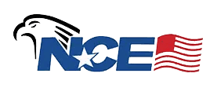

<SlideAudio deckKey="FEN_SUM_CI" />

# Summit Critical Illness Plan Overview

Understanding the details and benefits of the **Summit Critical Illness** Plans.

---
transition: fade-out
layout: default
---

## Introduction to Summit Critical Illness

Underwritten by: **Everest Reinsurance Company**

<v-click>

A unique **critical illness and injury** coverage plan.
</v-click>

<v-click>

Pays a lump-sum cash benefit for covered **critical illnesses and injuries.**
</v-click>

<v-click>

Membership through the **National Congress of Employers (NCE)**.

  

</v-click>

---
transition: fade-out
layout: default
---

## Key Features and Benefits

<v-click>

- **Critical Illness Benefits** - Lump-sum cash benefits for covered critical illnesses
</v-click>

<v-click>

- **Hospital Confinement Benefits** - Daily coverage for hospital stays ($50/day)
</v-click>

<v-click>

- **Multiple Benefit Levels** - Four plan options from $2,500 to $10,000
</v-click>

<v-click>

- **Recurrence Benefits** - Pays again for recurrence of heart attack, cancer, stroke, or coma
</v-click>

<v-click>

- **Additional Occurrence Benefits** - Pays for different critical illnesses diagnosed 12+ months apart
</v-click>

<v-click>

- **Guaranteed Issue** - No medical exam required
</v-click>

<v-click>

- **Age Eligibility** - 18 - 64 and dependent unmarried children under the age of 26
</v-click>

---
transition: fade-out
layout: default
---

## Association benefits through NCE (1/3)

<v-click>

**Core Medical Support**
- **Medical Bill Negotiations**: Patient advocates work on your behalf to reduce the cost of your medical bills.
- **24/7 Nurse Help Line**: Have 24/7 access to a registered nurse (RN) to answer questions on family health issues.
- **Laboratory Savings Program**: Efficient, affordable, and confidential solution to medical laboratory testing.
- **Medical Supplies & Equipment**: Save from **20% to 50%** off your medical supply needs.
</v-click>

<v-click>

**Dental & Vision Discount Care**
- **Aetna Dental Access® Network***: Savings ranging from **15-50%** per visit on covered dental services including cleanings, x-rays, fillings, root canals, crowns, bridges and orthodontia.
- **OUTLOOK Vision Network***: Savings of **10% to 50%** on most prescription eyeglasses, frames, and lenses through over **12,000 optical centers**.

</v-click>

<small>

*This program is not available in Alaska, Montana, Rhode Island, Utah, Vermont and Washington.

**Disclaimer:** National Congress of Employers (NCE) association benefits are not affiliated with Everest Reinsurance Company. Summit Plan benefits are not dependent on the use of the association's providers. NCE membership is available without purchasing this plan. The benefits listed are not insurance and do not provide coverage, they only provide discounts and services. Benefit discounts and services vary by state. Please refer to the NCE Membership brochure for complete details. Association membership can be purchased without insurance at https://nceassociation.org/.

</small>

---
transition: fade-out
layout: default
---

## Association benefits through NCE (2/3)

<v-click>

**Prescription Savings**
- **Prescription Discount Card**: Save an average of **55%** on generic drugs and **15%** on brand-name drugs at over **80%** of pharmacies.
- **MedAfford Global**: Save up to **80%** on prescription medications with insulin medication savings of **45%** or better.
- **Diabetic Supplies**: Receive discounts on diabetes supplies at **20-85%** off retail prices.
</v-click>

<v-click>

**Natural Health Products**
- **CBD Products**: All natural ingredients and the purest form of Cannabidiol as a **safe alternative** to prescription painkillers.
- **Vitamins & Supplements**: Save up to **75%** off retail pricing on natural products including vitamins and supplements.

</v-click>

<small>

**Disclaimer:** National Congress of Employers (NCE) association benefits are not affiliated with Everest Reinsurance Company. Summit Plan benefits are not dependent on the use of the association's providers. NCE membership is available without purchasing this plan. The benefits listed are not insurance and do not provide coverage, they only provide discounts and services. Benefit discounts and services vary by state. Please refer to the NCE Membership brochure for complete details. Association membership can be purchased without insurance at https://nceassociation.org/.

</small>

---
transition: fade-out
layout: default
---

## Association benefits through NCE (3/3)

<v-click>

**Rehabilitation & Therapy**
- **Physical Therapy & Rehabilitation**: Save an average of **20%** at over **1,200 offices** with **4,000 providers** in 23 states.
- **Chiropractic Savings Program**: **Free initial consultation**, up to **50%** savings on diagnostic services, and unlimited treatments at up to **30%** savings from over **12,000 chiropractors**.
- **Speech Therapy**: Video conferencing technology for live, **one-on-one**, highly individualized speech therapy services.
- **Hearing Savings Program**: **Free hearing consultations** and exclusive discounts on the latest hearing aid technology.
</v-click>

<v-click>

**Wellness & Nutrition**
- **SDO Nutrition**: Helps achieve **personal health goals**, maintain a healthy lifestyle, and manage chronic health conditions through **food and diet education**.
</v-click>

<v-click>

<small>

**Disclaimer:** National Congress of Employers (NCE) association benefits are not affiliated with Everest Reinsurance Company. Summit Plan benefits are not dependent on the use of the association's providers. NCE membership is available without purchasing this plan. The benefits listed are not insurance and do not provide coverage, they only provide discounts and services. Benefit discounts and services vary by state. Please refer to the NCE Membership brochure for complete details. Association membership can be purchased without insurance at https://nceassociation.org/.

</small>

</v-click>

---
transition: fade-out
layout: default
clicks: 4
---

## Summit Critical Illness Plan Options

<small>

**Four plan levels** providing different benefit amounts for critical illness coverage.

</small>

<v-click>

| **Plan** | **Critical Illness Benefit** | **Waiting Period** | **Include Cancer** |
|----------|------------------------------|-------------------|-------------------|
| **Summit CI $2,500** | = 2 && 'font-bold']">$2,500 | = 3 && 'font-bold']">30 days | = 4 && 'font-bold']">Yes |
| **Summit CI $5,000** | = 2 && 'font-bold']">$5,000 | = 3 && 'font-bold']">30 days | = 4 && 'font-bold']">Yes |
| **Summit CI $7,500** | = 2 && 'font-bold']">$7,500 | = 3 && 'font-bold']">30 days | = 4 && 'font-bold']">Yes |
| **Summit CI $10,000** | = 2 && 'font-bold']">$10,000 | = 3 && 'font-bold']">30 days | = 4 && 'font-bold']">Yes |

</v-click>

<small>

**All plans include:** Recurrence Benefit, Additional Critical Illness Benefit, and Hospital Confinement Benefits.

**Disclaimer:** The amount of benefits provided depends upon the plan selected; the premium will vary with the amount of the benefits selected. Please check the product certificate or master policy for complete details. The indemnity and critical illness insurance products described here are underwritten by Everest Reinsurance Company, 100 Everest Way, Warren, NJ 07059, 1-800-438-4375. THESE PRODUCTS PROVIDE LIMITED BENEFIT INSURANCE. Limited benefits are insurance products with reduced benefits and are not intended to be an alternative to major medical or comprehensive healthcare coverage. Please read your certificate of insurance carefully.

</small>

---
transition: fade-out
layout: default
clicks: 3
---

## Hospital Confinement Benefits

<small>

**All plans provide** hospital confinement coverage with consistent benefit amounts.

</small>

<v-click>

| **Benefit** | **All Plans** |
|-------------|---------------|
| **Daily Hospital Confinement** | = 2 && 'font-bold']">$50 per day |
| **Maximum Period per Confinement** | = 3 && 'font-bold']">5 days |
| **Maximum Days per Year** | = 3 && 'font-bold']">30 days |

</v-click>

<small>

**No elimination period** for hospital confinement benefits. Coverage applies to all plans regardless of critical illness benefit amount.

**Disclaimer:** The amount of benefits provided depends upon the plan selected; the premium will vary with the amount of the benefits selected. Please check the product certificate or master policy for complete details. The indemnity and critical illness insurance products described here are underwritten by Everest Reinsurance Company, 100 Everest Way, Warren, NJ 07059, 1-800-438-4375. THESE PRODUCTS PROVIDE LIMITED BENEFIT INSURANCE. Limited benefits are insurance products with reduced benefits and are not intended to be an alternative to major medical or comprehensive healthcare coverage. Please read your certificate of insurance carefully.

</small>

---
transition: fade-out
layout: default
clicks: 4
---

## Critical Illness Coverage - Cardiac Conditions

<small>

**Cardiac conditions** provide some of the highest benefit percentages.

</small>

<v-click>

| **Condition** | **Benefit Amount** |
|---------------|-------------------|
| **Heart Attack (Myocardial Infarction)** | = 2 && 'font-bold']">100% of Benefit Amount |
| **Sudden Cardiac Arrest** | = 2 && 'font-bold']">100% of Benefit Amount |
| **Coronary Artery Disease - Bypass** | = 3 && 'font-bold']">25% of Benefit Amount |
| **Coronary Artery Disease - Angioplasty** | = 4 && 'font-bold']">25% of Benefit Amount |

</v-click>

<small>

**Disclaimer:** The amount of benefits provided depends upon the plan selected; the premium will vary with the amount of the benefits selected. Please check the product certificate or master policy for complete details. The indemnity and critical illness insurance products described here are underwritten by Everest Reinsurance Company, 100 Everest Way, Warren, NJ 07059, 1-800-438-4375. THESE PRODUCTS PROVIDE LIMITED BENEFIT INSURANCE. Limited benefits are insurance products with reduced benefits and are not intended to be an alternative to major medical or comprehensive healthcare coverage. Please read your certificate of insurance carefully.

</small>

---
transition: fade-out
layout: default
clicks: 4
---

## Critical Illness Coverage - Cancer & Stroke

<small>

**Cancer and stroke conditions** provide coverage with varying benefit levels.

</small>

<v-click>

| **Condition** | **Benefit Amount** |
|---------------|-------------------|
| **Invasive Cancer** | = 2 && 'font-bold']">100% of Benefit Amount |
| **Non-Invasive Cancer** | = 3 && 'font-bold']">25% of Benefit Amount |
| **Skin Cancer** | = 4 && 'font-bold']">$250-$1,000 lifetime |
| **Stroke** | = 2 && 'font-bold']">100% of Benefit Amount |

</v-click>

<small>

**Skin Cancer Benefits:** $250 (2.5k plan), $500 (5k/7.5k plans), $1,000 (10k plan) per lifetime.

**Disclaimer:** The amount of benefits provided depends upon the plan selected; the premium will vary with the amount of the benefits selected. Please check the product certificate or master policy for complete details. The indemnity and critical illness insurance products described here are underwritten by Everest Reinsurance Company, 100 Everest Way, Warren, NJ 07059, 1-800-438-4375. THESE PRODUCTS PROVIDE LIMITED BENEFIT INSURANCE. Limited benefits are insurance products with reduced benefits and are not intended to be an alternative to major medical or comprehensive healthcare coverage. Please read your certificate of insurance carefully.

</small>

---
transition: fade-out
layout: default
clicks: 3
---

## Critical Illness Coverage - Other Conditions

<small>

**Additional conditions** provide protection for various health challenges.

</small>

<v-click>

| **Condition** | **Benefit Amount** |
|---------------|-------------------|
| **Coma** | = 2 && 'font-bold']">100% of Benefit Amount |
| **End Stage Renal Failure** | = 2 && 'font-bold']">100% of Benefit Amount |
| **Major Organ Transplant** | = 2 && 'font-bold']">100% of Benefit Amount |
| **ALS (Lou Gehrig's Disease)** | = 2 && 'font-bold']">100% of Benefit Amount |
| **Multiple Sclerosis** | = 3 && 'font-bold']">50% of Benefit Amount |
| **Parkinson's Disease** | = 3 && 'font-bold']">50% of Benefit Amount |
| **Alzheimer's Disease** | = 3 && 'font-bold']">50% of Benefit Amount |

</v-click>

<small>
  
**Disclaimer:** The amount of benefits provided depends upon the plan selected; the premium will vary with the amount of the benefits selected. Please check the product certificate or master policy for complete details. The indemnity and critical illness insurance products described here are underwritten by Everest Reinsurance Company, 100 Everest Way, Warren, NJ 07059, 1-800-438-4375. THESE PRODUCTS PROVIDE LIMITED BENEFIT INSURANCE. Limited benefits are insurance products with reduced benefits and are not intended to be an alternative to major medical or comprehensive healthcare coverage. Please read your certificate of insurance carefully.

</small>

---
transition: fade-out
layout: default
---

## Recurrence & Additional Benefits

<small>

**Unique benefits** that provide ongoing protection and additional coverage opportunities.

</small>

<v-click>

**Recurrence Benefit:**
- Pays again for recurrence of **Heart Attack**, **Invasive Cancer**, **Stroke**, or **Coma**
- Must be separated by **12+ months** from prior diagnosis
- **No treatment** during the 12-month period between diagnoses
</v-click>

<v-click>

**Additional Critical Illness Benefit:**
- **One-time benefit** for a different critical illness or injury
- Must be diagnosed **12+ months** after any other critical illness
- Eligible for recurrence benefit if covered
</v-click>

<small>

**Important:** These benefits provide ongoing protection and multiple claim opportunities for covered persons.

</small>

---
transition: fade-out
layout: default
---

## Limitations and Exclusions for Summit Critical Illness

<v-clicks>

- **30-day waiting period** for all critical illness benefits
- **Maximum benefit amount** per covered person per condition
- Excludes **self-inflicted injuries**, **suicide**, **intoxication-related incidents**
- Excludes **war**, **military service**, **aviation** (except as a fare-paying passenger)

</v-clicks>

<v-click>

<small>

**Important Coverage Notes:**  
- Critical Illness benefits are separate from other insurance coverage
- Benefits are paid based on the specific condition diagnosed as outlined in the benefit schedule
- Recurrence and additional occurrence benefits have specific timing requirements
- All conditions must meet the medical criteria specified in the policy

</small>

</v-click>

<v-click>

<small>

Please refer to the complete policy certificate for full benefit details, limitations, and exclusions.

</small>

</v-click>

---
transition: fade-out
layout: default
---

## Key Takeaways for Summit Critical Illness

<v-clicks>

- **Four plan levels** ($2,500 to $10,000) allow prospects to choose coverage that fits their budget
- **Recurrence Benefits** provide ongoing protection for heart attack, cancer, stroke, and coma
- **Additional Occurrence Benefits** pay for different critical illnesses diagnosed 12+ months apart
- **Hospital Confinement Benefits** provide daily coverage ($50/day) across all plans
- **NCE Association Benefits** provide extensive discounts and services at no extra cost
- **Critical Illness benefits** pay regardless of other insurance coverage

</v-clicks>

---
transition: fade-out
layout: end
---

# Thank You!

Continue to be great!
