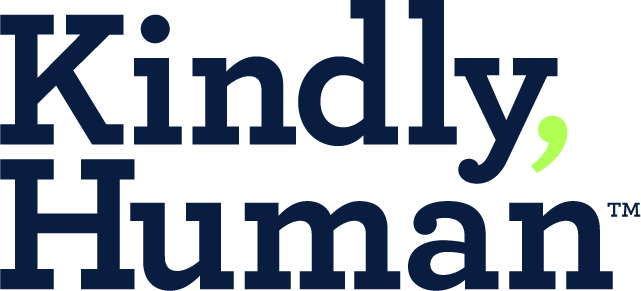

<SlideAudio />

# MedFirst 1 Plan Overview

Understand the details and benefits of the **MedFirst 1 Plan**.

---
transition: fade-out
layout: one-half-img-center
image: img/mf1.jpg
line: As mentioned before, any time we're seeing the numbers listed next to a benefit, it indicates required verbiage at the bottom of the page that must be covered with the client. The plan benefits are listed on the left and the benefit details on the right.
---

<v-click>
  <Arrow v-bind="{ x1:350, y1:10, x2:410, y2:80, color: 'var(--slidev-theme-accent)' }" />
</v-click>
<v-click>
  <Arrow v-bind="{ x1:150, y1:413, x2:310, y2:413, color: 'var(--slidev-theme-accent)' }" />
</v-click>

---
transition: fade-out
layout: one-half-img
image: img/mf1.jpg
line: Starting with our Primary Care Office Visit, we can see it will cover 3 visits per calendar year at a $25 Co payment with the maximum of $150. They must access providers through First Health Network when utilizing the Physician Services to be covered by the plan.
---

## Primary Care Office Visit

<v-click>
- Visit Allowance: 3 visits per year
<Arrow v-bind="{ x1:720, y1:60, x2:720, y2:108, color: 'var(--slidev-theme-accent)' }" />
</v-click>
<v-click>
- Visit Co-Payment: $25
<Arrow v-bind="{ x1:770, y1:60, x2:770, y2:108, color: 'var(--slidev-theme-accent)' }" />
</v-click>
<v-click>
- Annual Max: $150
<Arrow v-bind="{ x1:850, y1:60, x2:850, y2:108, color: 'var(--slidev-theme-accent)' }" />
</v-click>
<v-click>
- Must use First Health Network providers
<Arrow v-bind="{ x1:470, y1:410, x2:560, y2:410, color: 'var(--slidev-theme-accent)' }" />
</v-click>

---
transition: fade-out
layout: one-half-img
image: img/mf1.jpg
line: For the Specialist or Urgent Care Office Visit, we can see it will cover 1 visit per calendar year at a $50 Co payment with the maximum of $300. All sickness benefits are subject to a 30-day waiting period before benefits are payable under the plan.
---

## Specialist/Urgent Care

<v-click>
- Visit Allowance: 1 visit per year
<Arrow v-bind="{ x1:720, y1:100, x2:720, y2:140, color: 'var(--slidev-theme-accent)' }" />
</v-click>
<v-click>
- Visit Co-Payment: $50
<Arrow v-bind="{ x1:770, y1:100, x2:770, y2:140, color: 'var(--slidev-theme-accent)' }" />
</v-click>
<v-click>
- Annual Max: $300
<Arrow v-bind="{ x1:850, y1:100, x2:850, y2:140, color: 'var(--slidev-theme-accent)' }" />
</v-click>
<v-click>
- 30-day waiting period for sickness benefits
<Arrow v-bind="{ x1:470, y1:405, x2:560, y2:405, color: 'var(--slidev-theme-accent)' }" />
</v-click>

---
transition: fade-out
layout: one-half-img
image: img/mf1.jpg
line: Next up is the In-Patient Hospitalization Benefit. This is and Indemnity Benefit and would receive $1000 per day for a maximum of $5,000 per Calander year. This benefit will not pay out for pre-existing conditions for the first 12 months of coverage.
---

## In-Patient Hospitalization

<v-click>
- Daily Indemnity: $1,000/day
<Arrow v-bind="{ x1:720, y1:130, x2:720, y2:172, color: 'var(--slidev-theme-accent)' }" />
</v-click>
<v-click>
- Annual Max: $5,000
<Arrow v-bind="{ x1:795, y1:130, x2:795, y2:172, color: 'var(--slidev-theme-accent)' }" />
</v-click>
<v-click>
- Pre-existing conditions: Not covered first 12 months
<Arrow v-bind="{ x1:870, y1:130, x2:870, y2:172, color: 'var(--slidev-theme-accent)' }" />
</v-click>

---
transition: fade-out
layout: one-half-img
image: img/mf1.jpg
line: The telemedicine benefit offered by Kindly Human through Recurral Health, there is a $0.00 consult fee and no maximum visit amount. This is a benefit that allows members to keep healthcare cost down when it comes to certain physician services. Recuro Health would be the telemedicine number they would call provided on their member ID Card.
---

## Telemedicine

<v-click>
- Provider: 

  
  

<Arrow v-bind="{ x1:470, y1:225, x2:560, y2:225, color: 'var(--slidev-theme-accent)' }" />
</v-click>

<v-click>
- Consult Fee: $0
<Arrow v-bind="{ x1:745, y1:180, x2:745, y2:215, color: 'var(--slidev-theme-accent)' }" />
</v-click>

<v-click>
- Visit Allowance: Unlimited
<Arrow v-bind="{ x1:850, y1:180, x2:850, y2:215, color: 'var(--slidev-theme-accent)' }" />
</v-click>

<v-click>
- Contact: Number on member ID Card
</v-click>

---
transition: fade-out
layout: one-half-img
image: img/mf1.jpg
line: Next up is the RX benefit. This is offered through Best Choice RX and for this particular plan members would utilize the Best Choice RX Group discount program. It is important to point out that this is a group discount program NOT a prescription drug plan and is available at participating pharmacies only. This means it will offer discounts for medications, but they will not have predictable Copayments like the other prescription drug coverage we are about to review. It is extremely important to explain this benefit accurately to clients.
---

## RX Benefits

<v-click>
- Provider:

  
  <Arrow v-bind="{ x1:470, y1:265, x2:560, y2:265, color: 'var(--slidev-theme-accent)' }" />

</v-click>

<v-click>
- Important Note: NOT a prescription drug plan
</v-click>

<v-click>
- Available at participating pharmacies only
</v-click>

<v-click>
- No predictable copayments
</v-click>

<v-click>
- Must be explained accurately to clients
</v-click>

---
transition: fade-out
layout: one-half-img
image: img/mf1.jpg
line: For Healthcare Ninja, this benefit is a great tool to utilize to keep healthcare costs down and would be utilized with the Indemnity Benefits like Hospitalization as well as other physician service benefits once the plan benefits have been exhausted.
---

## Advocacy

<v-click>
- Provider:

  
  <Arrow v-bind="{ x1:470, y1:322, x2:560, y2:322, color: 'var(--slidev-theme-accent)' }" />

</v-click>
<v-click>
- Cost management tool
</v-click>
<v-click>
- Works with Indemnity Benefits
</v-click>
<v-click>
- Used after plan benefits are exhausted
</v-click>

---
transition: fade-out
layout: one-half-img
image: img/mf1.jpg
line: As we continue, you'll notice the required verbiage at the bottom of the page that correlates to specific benefits and benefit details that we must cover with our members.
---

## Required Verbiage

<v-click>
- Correlates to specific benefits
<Arrow v-bind="{ x1:590, y1:10, x2:650, y2:80, color: 'var(--slidev-theme-accent)' }" />
<Arrow v-bind="{ x1:390, y1:413, x2:550, y2:413, color: 'var(--slidev-theme-accent)' }" />
</v-click>

<v-click>
- Must be covered with members
</v-click>

---
transition: fade-out
layout: one-half-img
image: img/mf2.jpg
line: Continuing on for the minimal essential coverage preventative health services summary of benefits. We want to make sure when covering these with clients that we're going over all verbiage. Preventative benefit would be the same for all MedFirst Plans.
---

## Preventative Health Services

<v-click>
- Minimal essential coverage
</v-click>

<v-click>
- Must cover all verbiage with clients
<Arrow v-bind="{ x1:420, y1:150, x2:550, y2:150, color: 'var(--slidev-theme-accent)' }" />
</v-click>

<v-click>
- Same for all MedFirst Plans
</v-click>

---
transition: fade-out
layout: one-half-img
image: img/mf2.jpg
line: Now when reviewing the preventative health services, you'll notice we have our benefits, our intervals and our requirements. Benefit explains the preventative service being provided. Interval explains how often they are able to utilize the benefits.  Our requirement field not only lets us know what requirements are needed from clients for the services, but also in some instances explains what the benefit is and who it may be applicable to.
---

## Understanding Preventative Services

<v-click>
<Arrow v-bind="{ x1:625, y1:170, x2:625, y2:205, color: 'var(--slidev-theme-accent)' }" />
</v-click>

<v-click>
<Arrow v-bind="{ x1:735, y1:170, x2:735, y2:205, color: 'var(--slidev-theme-accent)' }" />
</v-click>

<v-click>
<Arrow v-bind="{ x1:840, y1:170, x2:840, y2:205, color: 'var(--slidev-theme-accent)' }" />
</v-click>

<v-click>
- Benefits: Services provided
</v-click>

<v-click>
- Intervals: Frequency of use
</v-click>

<v-click>
- Requirements: Eligibility and specifications
</v-click>

---
transition: fade-out
layout: one-half-img
image: img/mf2.jpg
line: For example for the domino aortic aneurysm screenings benefit. It lets me know that this is by ultrasonography in men, they can only use it once per lifetime, and they must be of ages 65 to 75 years who've ever smoked. So this would NOT be for non-smokers and or people aged 64 or younger or 76 and older.
---

#### Example: 
## Abdominal Aortic Aneurysm Screening
<v-click>
<Arrow v-bind="{ x1:470, y1:228, x2:550, y2:228, color: 'var(--slidev-theme-accent)' }" />
</v-click>

<v-click>
- Method: Ultrasonography
</v-click>

<v-click>
- Frequency: Once per lifetime
</v-click>

<v-click>
- Eligibility: Men ages 65-75 who have smoked
</v-click>

<v-click>
- Not for: Non-smokers or other age groups
</v-click>

---
transition: fade-out
layout: one-half-img-many
images: 
  - 'img/mf2.jpg'
  - 'img/mf3.jpg'
  - 'img/mf4.jpg'
  - 'img/mf5.jpg'
line: As you guys can see, the list is extensive, but it is a comprehensive list of preventative services.
---

## Preventative Services Overview

<v-clicks>

- Comprehensive list of services

</v-clicks>

---
transition: fade-out
layout: one-half-img-many
images: 
  - 'img/mf6.jpg'
  - 'img/mf7.jpg'
line: Next would be immunizations. It is important to keep in mind what immunizations are available for which age group so it's key to check the age group prior to quoting a benefit being covered.
---

## Immunizations

<v-click>
- Age-specific coverage
<Arrow v-bind="{ x1:570, y1:85, x2:645, y2:85, color: 'var(--slidev-theme-accent)' }" />
<Arrow v-bind="{ x1:570, y1:178, x2:645, y2:178, color: 'var(--slidev-theme-accent)' }" />
<Arrow v-bind="{ x1:570, y1:322, x2:645, y2:322, color: 'var(--slidev-theme-accent)' }" />
</v-click>

<v-click>
- Check eligibility before quoting
<Arrow v-bind="{ x1:570, y1:430, x2:645, y2:430, color: 'var(--slidev-theme-accent)' }" />
</v-click>

---
transition: fade-out
layout: one-half-img-many
images: 
  - 'img/mf6.jpg'
  - 'img/mf7.jpg'
line: So as you can see, birth through 6 year olds would be the eligibility group for these vaccinations. As we continue children from 7 through 18 years old and we also have adults 19 years or older. These immunizations are based upon CDC recommendations and it's important as well to make sure that we're covering the exclusions with our clients.
---

## Immunization Age Groups

<v-click>

- Birth through 6 years

- 7 through 18 years

- Adults 19 years or older
<Arrow v-bind="{ x1:570, y1:85, x2:645, y2:85, color: 'var(--slidev-theme-accent)' }" />
<Arrow v-bind="{ x1:570, y1:178, x2:645, y2:178, color: 'var(--slidev-theme-accent)' }" />
<Arrow v-bind="{ x1:570, y1:322, x2:645, y2:322, color: 'var(--slidev-theme-accent)' }" />
</v-click>

<v-click>
- Follow CDC recommendations
<Arrow v-bind="{ x1:570, y1:412, x2:645, y2:412, color: 'var(--slidev-theme-accent)' }" />
</v-click>

<v-click>
- Review exclusions with clients
<Arrow v-bind="{ x1:570, y1:432, x2:645, y2:432, color: 'var(--slidev-theme-accent)' }" />
</v-click>

---
transition: fade-out
layout: default
line: Some additional items to keep in mind whenever reviewing the MedFirst1 Plan.
---

## Key Points to Remember

<v-clicks>

- Must use **First Health Network providers** when Utilizing Physician Services
- **Best Choice RX** is a discount program only
- Telemedicine through **Kindly Human/Recuro Health**
- **Healthcare Ninja** for cost management
- Complete and compliant client care

</v-clicks>

---
transition: fade-out
layout: end
line: Thank you for participating in First Enroll's Training and continue to be great!!
---

# Thank You!

Continue to be great!

