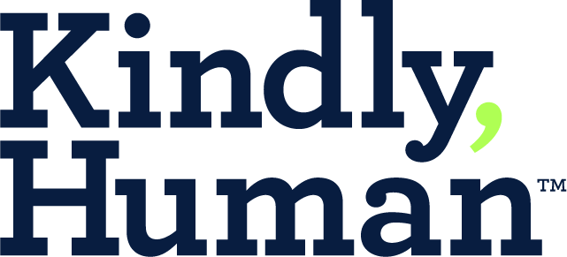
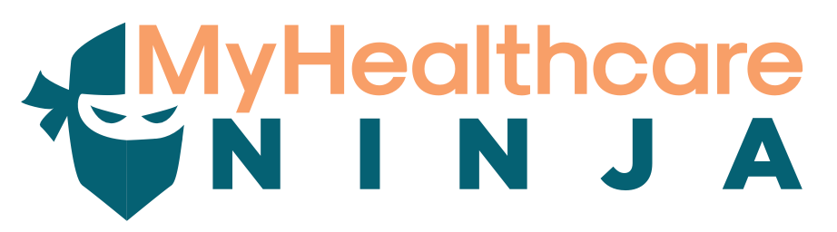

<SlideAudio />

# MedFirst Plan Overview

Understanding the details and benefits of the **MedFirst Plan**.

---
transition: fade-out
layout: default
---

## MedFirst Plan Details

<v-clicks>

- Access healthcare services at **controlled costs**
- All Plans Utilize **First Health Network** for physician services
- Some plans include **limited indemnity hospital benefits**
- Some provide **set number of physician visits**
- All plans include **Preventive Health Services coverage**

</v-clicks>

---
transition: fade-out
layout: default
---

## Key Common Points

<v-click>

Sickness benefits have a 30-day waiting period
</v-click>

<v-click>

Must use **First Health Network** providers for physician services
</v-click>

<v-click>

Indemnity hospital benefits are not restricted to in-network providers
</v-click>

<v-click>

Preventive benefits must be received at outpatient facilities
</v-click>

<v-click>

Prescription coverage varies by plan
</v-click>

<v-click>

Telemedicine services through:

  
  

</v-click>

<v-click>

Advocacy tool is provided:

  

</v-click>

<v-click>

12-month pre-existing condition waiting period still applies
</v-click>

---
transition: fade-out
layout: one-half-img-center
image: img/FEN_MF-02.jpg
---

## Required Verbiage

<v-click>
  <Arrow v-bind="{ x1:350, y1:10, x2:410, y2:80, color: 'var(--slidev-theme-accent)' }" />
</v-click>
<v-click>
  <Arrow v-bind="{ x1:200, y1:380, x2:310, y2:380, color: 'var(--slidev-theme-accent)' }" />
</v-click>

---
transition: fade-out
layout: one-half-img
image: img/FEN_MF-08.jpg
---

## Understanding Preventative Services

<v-click>
- Benefits: Services provided
<Arrow v-bind="{ x1:625, y1:170, x2:625, y2:205, color: 'var(--slidev-theme-accent)' }" />
</v-click>

<v-click>
- Intervals: Frequency of use
<Arrow v-bind="{ x1:735, y1:170, x2:735, y2:205, color: 'var(--slidev-theme-accent)' }" />
</v-click>

<v-click>
- Requirements: Eligibility and specifications
<Arrow v-bind="{ x1:840, y1:170, x2:840, y2:205, color: 'var(--slidev-theme-accent)' }" />
</v-click>

---
transition: fade-out
layout: one-half-img-many
images: 
  - 'img/FEN_MF-08.jpg'
  - 'img/FEN_MF-09.jpg'
  - 'img/FEN_MF-10.jpg'
  - 'img/FEN_MF-11.jpg'
---

## Preventative Services Overview

---
transition: fade-out
layout: one-half-img-many
images: 
  - 'img/FEN_MF-12.jpg'
  - 'img/FEN_MF-13.jpg'
  - 'img/FEN_MF-14.jpg'
---

## Immunizations

<v-click>

- Birth through 6 years

- 7 through 18 years

- Adults 19 years or older
<Arrow v-bind="{ x1:470, y1:85, x2:535, y2:85, color: 'var(--slidev-theme-accent)' }" />
<Arrow v-bind="{ x1:470, y1:178, x2:535, y2:178, color: 'var(--slidev-theme-accent)' }" />
<Arrow v-bind="{ x1:700, y1:70, x2:760, y2:70, color: 'var(--slidev-theme-accent)' }" />
</v-click>

<v-click>

**Check eligibility before quoting**
<Arrow v-bind="{ x1:700, y1:178, x2:760, y2:178, color: 'var(--slidev-theme-accent)' }" />
<Arrow v-bind="{ x1:470, y1:400, x2:535, y2:400, color: 'var(--slidev-theme-accent)' }" />
</v-click>

---
transition: fade-out
layout: one-half-img
image: img/FEN_MF-02.jpg
---

## Wellness Plan

<v-click>

**Physician Services**

- 1 annual Wellness exam
- $25 copayment, up to $150 maximum.
<Arrow v-bind="{ x1:480, y1:158, x2:560, y2:158, color: 'var(--slidev-theme-accent)' }" />
</v-click>

<v-click>

**Telemedicine**

- **Provider:** Kindly Human/Recuro Health
- $0 consult fee, unlimited visits
<Arrow v-bind="{ x1:480, y1:235, x2:560, y2:235, color: 'var(--slidev-theme-accent)' }" />
</v-click>

<v-click>

**Rx Coverage**

- **Provider:** Best Choice RX Group Discount Program
- **Discount program only**
- No standard copays, discounts vary by medication
<Arrow v-bind="{ x1:480, y1:282, x2:560, y2:282, color: 'var(--slidev-theme-accent)' }" />
</v-click>

<v-click>

**No Indemnity Hospital Benefits**
</v-click>

---
transition: fade-out
layout: one-half-img
image: img/FEN_MF-03.jpg
---

## MedFirst 1 Plan Details

<v-click>

**Physician Services**

- Primary Care: 3 visits/yr ($25 copay, $150 max)
- Specialist/Urgent: 1 visits/yr ($50 copay, $300 max)
- Inpatient: $1,000/day ($5,000 annual max)
<Arrow v-bind="{ x1:480, y1:146, x2:560, y2:146, color: 'var(--slidev-theme-accent)' }" />
</v-click>

<v-click>

**Telemedicine**

- $0 consult, unlimited visits
<Arrow v-bind="{ x1:480, y1:222, x2:560, y2:222, color: 'var(--slidev-theme-accent)' }" />
</v-click>

<v-click>

**Rx Coverage** 

- **Provider:** Best Choice RX Group Discount Program
- **Discount program only**
- No standard copays, discounts vary by medication
<Arrow v-bind="{ x1:480, y1:262, x2:560, y2:262, color: 'var(--slidev-theme-accent)' }" />
</v-click>

<v-click>

**Advocacy:**

- Healthcare Ninja cost management
<Arrow v-bind="{ x1:480, y1:325, x2:560, y2:325, color: 'var(--slidev-theme-accent)' }" />
</v-click>

---
transition: fade-out
layout: one-half-img
image: img/FEN_MF-04.jpg
---

## MedFirst 2 Plan Details

<v-click>

**Physician Services**

- Primary Care: 4 visits/yr ($25 copay, $150 max)
- Specialist/Urgent: 2 visits/yr ($50 copay, $300 max)
- Inpatient: $1,000/day ($10,000 annual max)
<Arrow v-bind="{ x1:480, y1:146, x2:560, y2:146, color: 'var(--slidev-theme-accent)' }" />
</v-click>

<v-click>

**Telemedicine**

- $0 consult, unlimited visits
<Arrow v-bind="{ x1:480, y1:222, x2:560, y2:222, color: 'var(--slidev-theme-accent)' }" />
</v-click>

<v-click>

**Rx Coverage** 

- Preventive & Acute Generics: $0 copay
- Maintenance Generics: $5 copay (200 medications)
- 30-day retail and 90-day mail-order options
- No monthly maximum on formulary drugs
- Prescription Assistance Program available (income-based)
<Arrow v-bind="{ x1:480, y1:292, x2:560, y2:292, color: 'var(--slidev-theme-accent)' }" />
</v-click>

<v-click>

**Advocacy:**

- Healthcare Ninja cost management
<Arrow v-bind="{ x1:480, y1:402, x2:560, y2:402, color: 'var(--slidev-theme-accent)' }" />
</v-click>

---
transition: fade-out
layout: one-half-img
image: img/FEN_MF-05.jpg
---

## MedFirst 3 Plan Details

<v-click>

**Physician Services**

- Primary Care: 4 visits/yr ($25 copay, $150 max)
- Specialist/Urgent: 4 visits/yr ($50 copay, $300 max)
- Inpatient: $1,000/day ($15,000 annual max)
<Arrow v-bind="{ x1:480, y1:130, x2:560, y2:130, color: 'var(--slidev-theme-accent)' }" />
</v-click>

<v-click>

**Telemedicine**

- $0 consult, unlimited visits
<Arrow v-bind="{ x1:480, y1:180, x2:560, y2:180, color: 'var(--slidev-theme-accent)' }" />
</v-click>

<v-click>

**Rx Coverage (Best Choice RX Plus)** 

- Preventive & Acute Generics: $0 copay
- Maintenance Generics: $5 copay (200 medications)
- Brand: $40/30-day retail, $80/90-day mail
- $150 monthly limit, Specialty not covered
<Arrow v-bind="{ x1:480, y1:280, x2:560, y2:280, color: 'var(--slidev-theme-accent)' }" />
</v-click>

<v-click>

**Advocacy:**

- Healthcare Ninja cost management
<Arrow v-bind="{ x1:480, y1:400, x2:560, y2:400, color: 'var(--slidev-theme-accent)' }" />
</v-click>

---
transition: none
layout: one-half-img
image: img/FEN_MF-06.jpg
---

## MedFirst 4 Plan (1 of 2)

<v-click>

**Physician Services**

- Wellness Exam: 1/yr ($25 copay, $150 max)
- Primary Care: 4/yr ($50 copay, $150 max)
- Specialist/Urgent: 4/yr ($75 copay, $300 max)
<Arrow v-bind="{ x1:480, y1:126, x2:560, y2:126, color: 'var(--slidev-theme-accent)' }" />
</v-click>

<v-click>

**Hospital Benefits**

- Inpatient: $1,500/day ($15,000 annual max)
- Surgery: $1,500/day ($2,000 combined max)
- ER/Ambulance: $1,000/$500 if admitted
<Arrow v-bind="{ x1:480, y1:180, x2:560, y2:180, color: 'var(--slidev-theme-accent)' }" />
</v-click>

---
transition: fade-out
layout: one-half-img
image: img/FEN_MF-06.jpg
---

## MedFirst 4 Plan (2 of 2)

<v-click>

**Telemedicine**
- $0 consult, unlimited visits, 24/7 access
<Arrow v-bind="{ x1:480, y1:232, x2:560, y2:232, color: 'var(--slidev-theme-accent)' }" />
</v-click>

<v-click>

**Rx Coverage (Best Choice RX Plus)** 
- Preventive & Acute Generics: $0
- Maintenance Generics: $5
- Brand: $40/30-day, $80/90-day mail
- $150 monthly limit
<Arrow v-bind="{ x1:480, y1:322, x2:560, y2:322, color: 'var(--slidev-theme-accent)' }" />
</v-click>

<v-click>

**Advocacy Services**
- Healthcare Ninja for cost management & claims
<Arrow v-bind="{ x1:480, y1:420, x2:560, y2:420, color: 'var(--slidev-theme-accent)' }" />
</v-click>

---
transition: none
layout: one-half-img
image: img/FEN_MF-07.jpg
---

## MedFirst 5 Plan (1 of 2)

<v-click>

**Physician Services**

- Wellness Exam: 1/yr ($25 copay, $150 max)
- Primary Care: 5/yr ($50 copay, $150 max)
- Specialist/Urgent: 5/yr ($75 copay, $300 max)
<Arrow v-bind="{ x1:480, y1:126, x2:560, y2:126, color: 'var(--slidev-theme-accent)' }" />
</v-click>

<v-click>

**Hospital Benefits**

- Inpatient: $1,500/day ($15,000 annual max)
- Surgery: $1,500/day ($4,500 combined max)
- ER/Ambulance: $1,000/$500 if admitted
<Arrow v-bind="{ x1:480, y1:180, x2:560, y2:180, color: 'var(--slidev-theme-accent)' }" />
</v-click>

---
transition: fade-out
layout: one-half-img
image: img/FEN_MF-07.jpg
---

## MedFirst 5 Plan (2 of 2)

<v-click>

**Telemedicine**
- $0 consult, unlimited visits, 24/7 access
<Arrow v-bind="{ x1:480, y1:232, x2:560, y2:232, color: 'var(--slidev-theme-accent)' }" />
</v-click>

<v-click>

**Rx Coverage (Best Choice RX Enhanced)** 

- Preventive & Acute Generics: $0 copay
- Maintenance Generics: $5 copay (200 medications)
- 30-day retail and 90-day mail-order options
- No monthly maximum on formulary drugs
- Prescription Assistance Program available (income-based)
<Arrow v-bind="{ x1:480, y1:322, x2:560, y2:322, color: 'var(--slidev-theme-accent)' }" />
</v-click>

<v-click>

**Advocacy Services**
- Healthcare Ninja for cost management & claims
<Arrow v-bind="{ x1:480, y1:420, x2:560, y2:420, color: 'var(--slidev-theme-accent)' }" />
</v-click>

---
transition: fade-out
layout: default
line: Some additional items to keep in mind whenever reviewing the MedFirst1 Plan.
---

## Key Points to Remember

<v-clicks>

- Must use **First Health Network providers** when Utilizing Physician Services
- **Best Choice RX** is a discount program only
- Telemedicine through **Kindly Human/Recuro Health**
- **Healthcare Ninja** for cost management
- 12-month waiting period for pre-existing conditions
- Complete and compliant client care

</v-clicks>

---
transition: fade-out
layout: end
line: Thank you for participating in First Enroll's Training and continue to be great!!
---

# Thank You!

Continue to be great!

